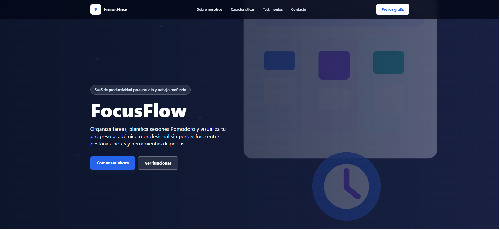
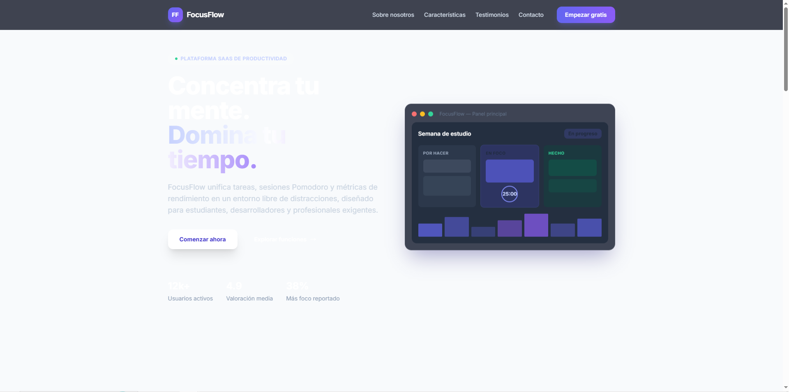

# Práctica Formativa Obligatoria 2: Prompt Engineering en Agentes de IA

**Institución:** Instituto de Formación Técnica Superior N° 29  
**Materia:** Desarrollo de Sistemas Web Frontend  
**Fecha de Entrega:** 26/06/2026  

---

## 👤 Datos del Estudiante
* **Nombre:** Mario Julio Alegre  
* **Carrera:** Desarrollo de Sistemas Web Frontend  

---

## 🚀 Despliegue Unificado
El proyecto se encuentra desplegado en Vercel en un único enlace que dirige a la portada de acceso, desde la cual se puede navegar hacia el prompt y hacia las dos versiones de la Landing Page generadas de forma autónoma:

🔗 **[Link al Deploy en Vercel](https://dsw-frontend-pfo2.vercel.app/)**


---

## 📝 Prompt Exacto Utilizado

El siguiente prompt de alta precisión fue diseñado siguiendo las buenas prácticas oficiales de diseño de instrucciones de OpenAI y Anthropic. Este bloque de texto plano se introdujo de forma idéntica como instrucción inicial en ambos agentes de IA para generar la Landing Page de manera 100% autónoma, sin intervenciones manuales posteriores en el código:

```markdown
# ROLE

Actúa como un Desarrollador Frontend Senior y Especialista en UX/UI con amplia experiencia en la creación de aplicaciones web modernas, accesibles, responsivas y listas para producción. Debes tomar decisiones técnicas razonables cuando existan múltiples alternativas válidas y aplicar buenas prácticas de desarrollo frontend.

# OBJECTIVE

Generar una Landing Page profesional para un producto SaaS llamado "FocusFlow", entregando una aplicación completa, funcional y lista para ejecutar localmente y desplegar en Vercel.

# PRODUCT CONTEXT

FocusFlow es una plataforma SaaS de productividad orientada a estudiantes universitarios, desarrolladores y profesionales que necesitan organizar tareas, gestionar tiempos de estudio y centralizar actividades académicas o laborales en un entorno moderno y libre de distracciones.

Las principales funcionalidades del producto son:

* Gestión de tareas mediante tableros Kanban.
* Temporizador Pomodoro integrado.
* Estadísticas de rendimiento y productividad.
* Seguimiento de objetivos académicos y profesionales.
* Interfaz simple, moderna y enfocada en la concentración.

La identidad visual debe transmitir:

* Innovación.
* Productividad.
* Tecnología.
* Profesionalismo.
* Simplicidad.

# TECHNICAL REQUIREMENTS

* Utilizar Next.js con TypeScript.
* Utilizar Tailwind CSS para los estilos.
* Aplicar una estructura de proyecto organizada y mantenible.
* Utilizar componentes reutilizables cuando sea apropiado.
* Mantener el código limpio y bien estructurado.
* El proyecto debe ser compatible con despliegue en Vercel.
* No incluir dependencias innecesarias.
* Utilizar buenas prácticas de accesibilidad (HTML semántico, jerarquía correcta de encabezados, formularios etiquetados y navegación clara).
* Garantizar diseño responsive para dispositivos móviles, tablets y escritorio utilizando un enfoque Mobile First.

# DESIGN REQUIREMENTS

* Estética moderna tipo startup tecnológica.
* Diseño profesional similar al utilizado por empresas SaaS actuales.
* Paleta de colores basada en tonos azules, violetas y neutros.
* Uso equilibrado de espacios, tipografía y jerarquía visual.
* Botones con estados visuales claros.
* Animaciones sutiles únicamente cuando aporten valor a la experiencia de usuario.
* Priorizar claridad visual y legibilidad.
* Incorporar recursos visuales coherentes con una startup tecnológica moderna.
* Utilizar imágenes, ilustraciones, iconografía o elementos gráficos cuando aporten valor a la experiencia de usuario.
* Mantener consistencia visual en todas las secciones de la Landing Page.

# REQUIRED LANDING PAGE STRUCTURE

La Landing Page debe incluir obligatoriamente las siguientes secciones:

## 1. Header

* Logo de FocusFlow.
* Menú de navegación.
* Botón principal de llamada a la acción.

## 2. Hero Section

* Título principal orientado a productividad.
* Subtítulo descriptivo.
* Botón CTA destacado.

## 3. Sobre Nosotros

* Descripción de la filosofía y propuesta de valor de FocusFlow.

## 4. Características Principales

Incluir al menos las siguientes funcionalidades:

* Tableros Kanban Académicos.
* Temporizador Pomodoro Integrado.
* Estadísticas de Rendimiento.

## 5. Testimonios

* Al menos dos testimonios ficticios.
* Incluir nombre y rol de cada usuario.

## 6. Formulario de Contacto

* Nombre.
* Correo electrónico.
* Mensaje.
* Botón de envío.
* No es necesario implementar backend.

## 7. Footer

* Redes sociales.
* Información legal simulada.
* Derechos de autor.

# CONSTRAINTS

* No solicitar aclaraciones adicionales.
* Asumir decisiones razonables cuando falte información.
* Tomar decisiones de diseño y arquitectura razonables cuando existan múltiples alternativas válidas.
* Completar todas las secciones requeridas.
* Evitar contenido genérico repetitivo.
* Generar textos coherentes con el contexto del producto.
* No dejar fragmentos incompletos ni comentarios indicando trabajo pendiente.

# ACCEPTANCE CRITERIA

La solución será considerada correcta únicamente si:

* El proyecto compila correctamente.
* Puede ejecutarse mediante npm install y npm run dev.
* La Landing Page es completamente responsive.
* Todas las secciones requeridas están presentes.
* El diseño es profesional y consistente.
* El código está organizado y listo para despliegue en Vercel.

# EXPECTED OUTPUT

Generar una aplicación Next.js que implemente la Landing Page solicitada, incluyendo todos los archivos necesarios para su ejecución local y despliegue en Vercel.

Entregar una solución lista para instalar, ejecutar y desplegar.
```

---

## 🤖 Agentes y Modelos Evaluados

1. **Primer Agente:** OpenAI Codex (v0.141.0)  
   * **Modelo de Lenguaje:** `gpt-5.5`  
2. **Segundo Agente:** Cursor (v3.8.11)  
   * **Modelo de Lenguaje:** `Composer 2.5 Fast`  

*Nota: Conforme a las restricciones estrictas de la consigna, no se modificó el código de forma manual en ninguna de las soluciones generadas, permitiendo evaluar la capacidad de resolución autónoma de cada herramienta.*

---

## 📸 Capturas de Pantalla

### 1. Landing Page - OpenAI Codex (gpt-5.5)


### 2. Landing Page - Cursor (Composer 2.5 Fast)
